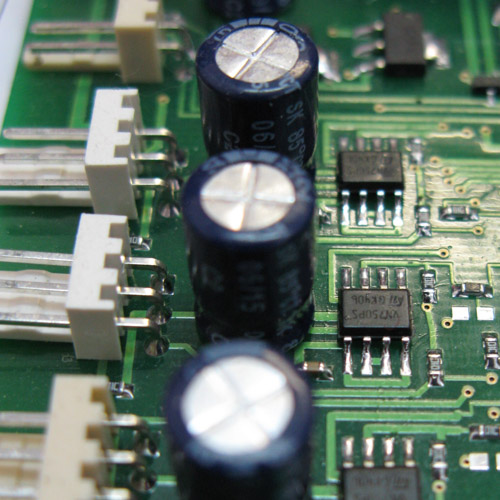
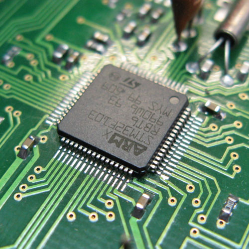

ООО "Сапфир СТ" оказывает услуги по ручному монтажу мелких серий печатных плат и прототипов.

При монтаже печатных плат выполняются следующие виды работ: 
<ul>
<li>поверхностный монтаж SMT (типоразмеры SMD компонентов от 0402); </li>
<li>выводной (штыревой) монтаж THT; </li>
<li>очистка (отмывка) плат и нанесение защитных покрытий.</li></ul>

Объем заказов - от 1 изделия. Время выполнения заказа - от 1 дня. Цена рассчитывается индивидуально и зависит от количества точек пайки, объема партии, конструктивно-технологических особенностей изделий.

Дополнительные услуги: пайка разъемов, кабелей, проводов, шлейфов, демонтаж компонентов, ремонт печатных плат и изделий, приобретение элементов (радиодеталей, микросхем).

<ul>
<li>Письмо с точным указанием монтируемых плат;</li>
<li>Исходный файл платы в формате PCAD;</li>
<li>Сборочный чертеж или монтажную схему, содержащую позиционные обозначения элементов и их ориентацию (AutoCAD, Word, Adobe Reader);</li>
<li>Спецификацию-перечень позиционных обозначений элементов и соответствующих им номиналов. Перечень должен точно соответствовать исходному файлу и монтажной схеме по позиционным обозначениям и перечню предоставляемой комплектации по количеству элементов и их номиналам и содержать информацию, в том числе, о не устанавливаемых компонентах (Word, Adobe Reader, Excel);</li>
</ul>

Дополнительные требования к монтажу (если есть):

<ul>
<li>промывка плат под лак;</li>
<li>поднятие на высоту;</li>
<li>формовка;</li>
<li>трансформаторы, дроссели (если собираются - то чертеж сборки);</li>
</ul>

<button type="button" class="close" data-dismiss="modal">x</button>
<h2>Монтаж</h2>

<button type="button" class="close" data-dismiss="modal">x</button>
<h2>Монтаж</h2>

 	
